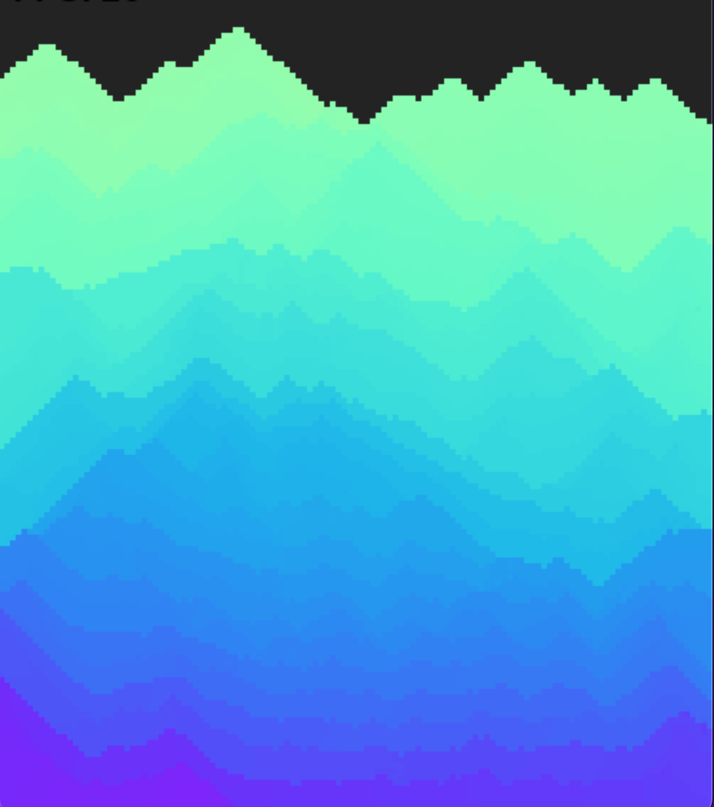
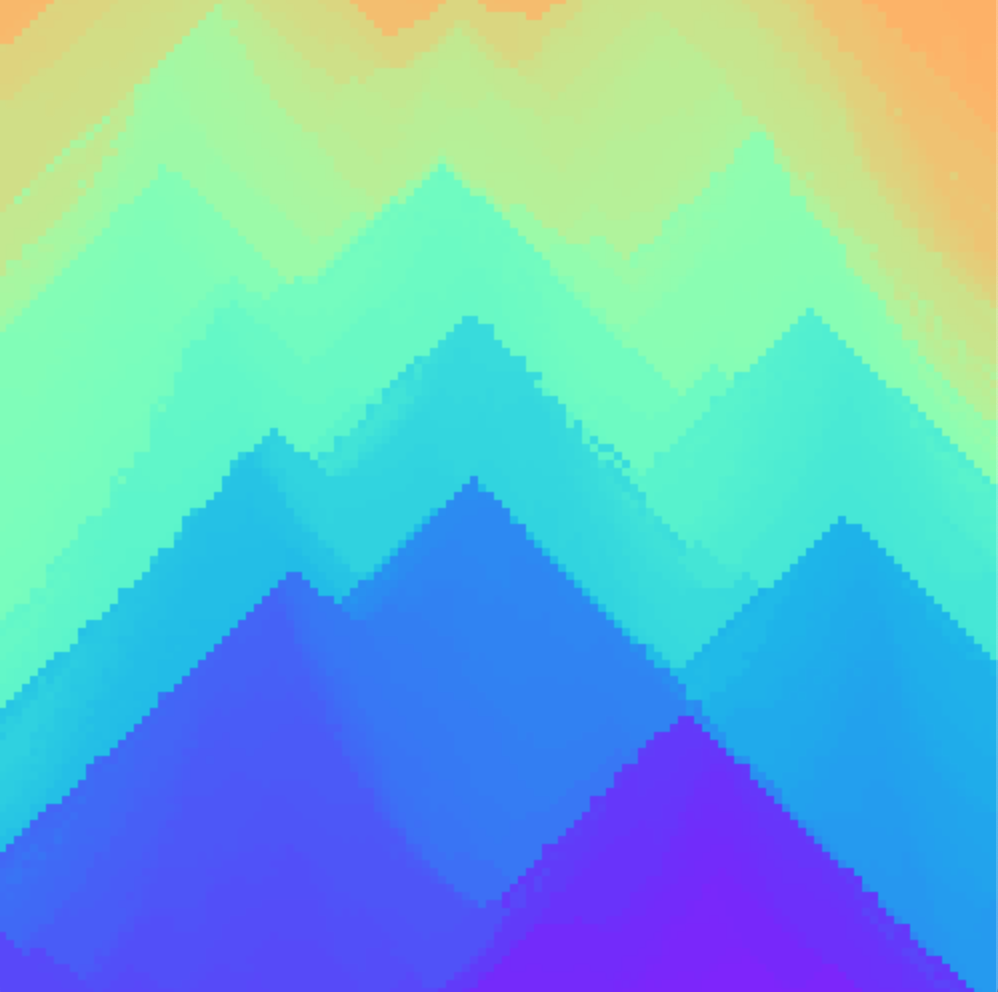

# Falling sand simulation
Simple simulation of sand falling.

  
  

Different colors of sand can be used to create interesting images.

Change the constant **USE_COLORED_SAND** to **True** to enable multi colored sand.

# How to run
Mac & Linux:

	python3 main.py

Windows:

	python main.py